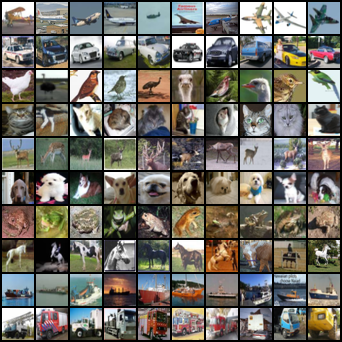
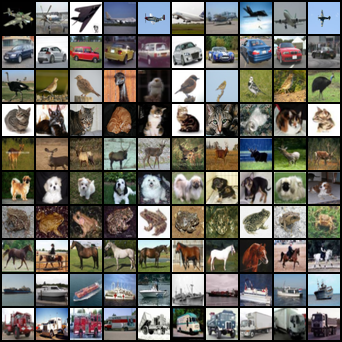
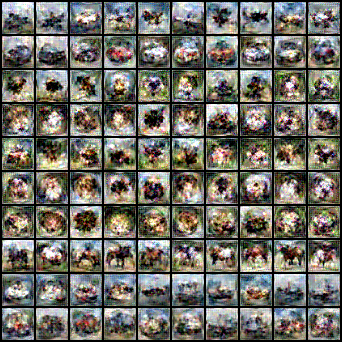
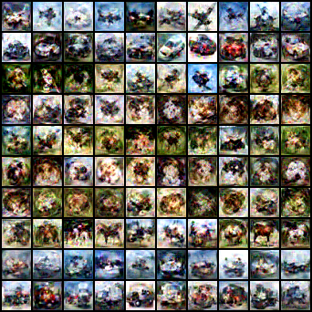
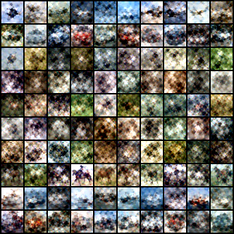
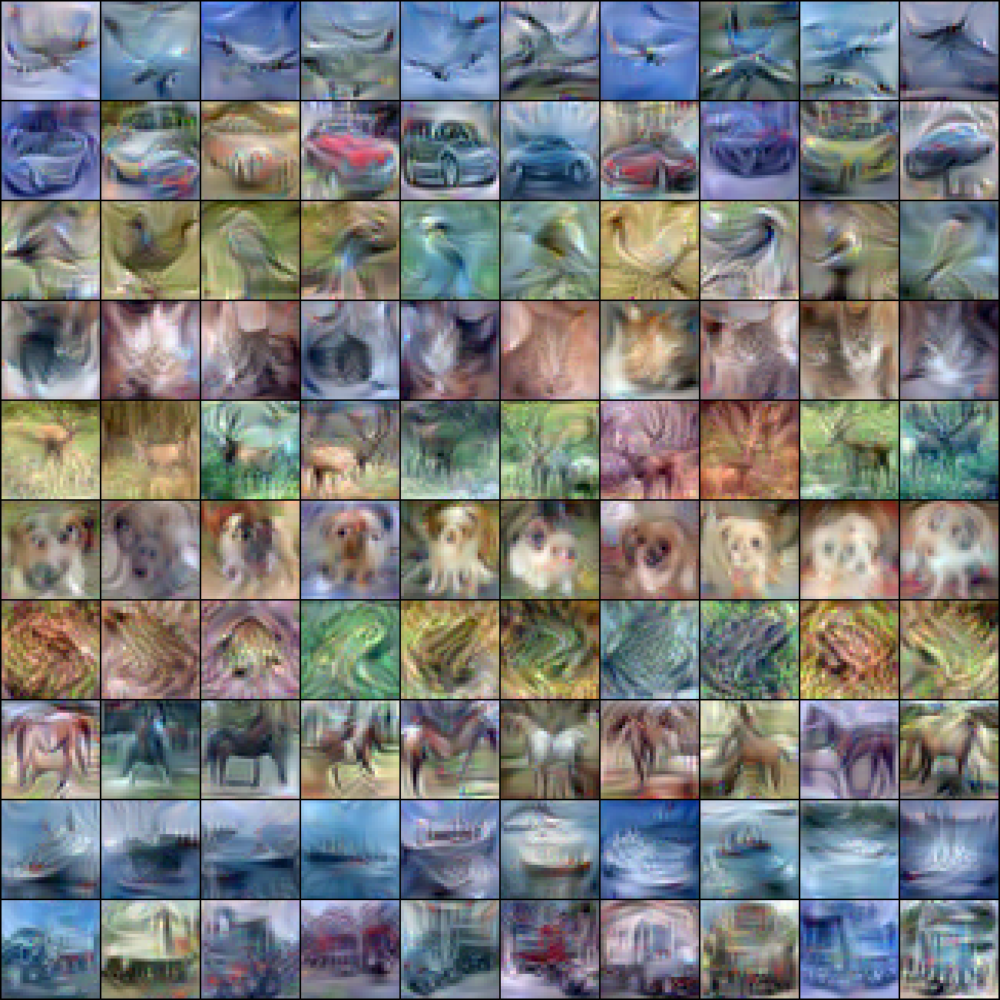

# DCBench

This is the official codebase for paper DC-BENCH: Dataset Condensation Benchmark.

The **leaderboard** is publicly avaiable at [DCBench Leaderboard](https://justincui03.github.io/dcbench/)


# How to set up
## Step 1
Run the following command to download the library to local
```
git clone git@github.com:justincui03/dc_benchmark.git
```
## Step 2
Download all(or part) of the data from [this shared link](https://drive.google.com/drive/folders/1trp0MyUoL9QrbsdQ8w7TxgoXcMJecoyH?usp=sharing)

### Step 3
Run the following command to create a conda environment
```
cd dc_benchmark
conda env create -f environment.yml
```

# Run an evaluation
Running an evaluation is very simple with DCBench
```
bash eval.sh --dataset CIFAR10 --ipc 1 --model convnet --aug autoaug
```
Here are the configurable parameters
- dataset: choose between CIFAR10, CIFAR100 and tinyimagenet
- ipc: choose between 1, 10 and 50
- model: choose between convnet, convnet4, mlp, resnet18, resnet152, etc
- aug: choose between autoaug, randaug, imagenet_aug, dsa,etc

# Neural Architecture Search
We incorparete the standard NAS-Bench-201 library into our codebase.
You can start a simple NAS experiment by running the following command
```
cd darts-pt
bash darts-201.sh --dc_method tm
```
- dc_method: which dataset condensation method to test, choose between random, kmeans-emb, dc, dsa, dm, tm

For the detailed setup, please refer to [DARTS-PT
](https://github.com/ruocwang/darts-pt)

# Example condensed datasets
|| |
|:--:|:--:|
|*Randomly selected images* | *Kmeans-emb selected images* |
| | |
|*Synthetic images by DC* | *Synthetic images by DSA* |
| ||
|*Synthetic images by DM* | *Synthetic images by TM* |

# Acknowledgments

Part of our code are adpoted from the following github repositories with license
- [DatasetCondensation](https://github.com/VICO-UoE/DatasetCondensation)
- [mtt-distillation](https://github.com/GeorgeCazenavette/mtt-distillation)
- [DARTS-PT](https://github.com/ruocwang/darts-pt)
